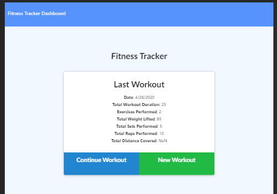

# WORKOUT TRACKER - NOSQL DATABASE
This fullstack app allows you to track and customize your workouts by adding new exercises to your plan using a noSQL database.

## USER STORY
As a user, I'd like to be able to view, create, and track my daily workouts. I want to be able to log multiple workouts on any given day and be able to keep track of them. I should be able to track the name, type, weight, sets, reps, and duration of each exercise. For cardio exercises, I should be able to also track the distance traveled during each exercise. 

## BUSINESS CONTEXT
This app can be considered viable if a consumer/user is able to track their workout progress in order to reach their fitness goals.

## ASSIGNMENT PARAMETERS
This app should meet the following criteria: 

* App should be able to add exercises to a previous workout plan.
* App should be able to add new exercises to a new workout plan.
* User should be able to view combined weight of multiple exercises on a 'stats' page.

## Running the App:
* Fork this repo and from terminal, run 'npm start'
* Open a browser and navigate to localhost 3000.

The app should look this this:

## Deployed App
This app is deployed at:
https://jaycee-crossfit-tracker.herokuapp.com/ 
